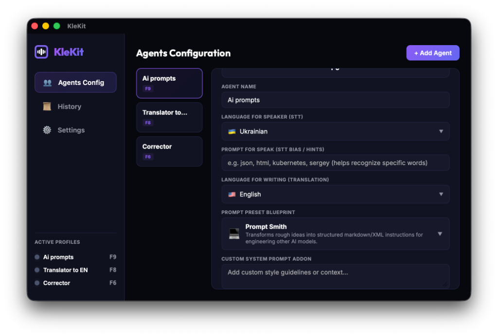

# KleKit 🎙️

> **Offline, privacy-first voice-to-text assistant for macOS (Apple Silicon) & Cross-Platform Systems**

KleKit lets you dictate text into any input field on your machine — no internet, no cloud, no data leaving your device. Press a hotkey, speak, and your refined text is pasted instantly wherever your cursor is.



---

## ✨ Features

- 🔒 **100% Offline** — all processing happens on-device via Apple Silicon (Metal) on macOS, or Vulkan/CUDA/DirectX on other platforms.
- ⚡ **Fast** — ~1 second model spin-up on M-series chips and modern hardware.
- 🧠 **Smart refinement** — Gemma 2 2B fixes grammar, formats technical terms, and cleans up speech artifacts.
- 🎯 **Works anywhere** — pastes text into any active input field (IDE, browser, Slack, Notes…).
- 💤 **Zero idle RAM** — models unload after 10 seconds of inactivity (20–30 MB at rest).
- 🌍 **Multi-language** — transcribes in your language, optionally translates to English.

---

## 🏗️ Architecture

```
Hotkey (hold) ──> cpal Recorder ──> whisper-rs STT (GGML) ──> Gemma 2 LLM (GGUF) ──> OS Paste Inject
```

| Module | Technology / Implementation | Role |
|---|---|---|
| Audio capture | `cpal` (see [src/audio.rs](file:///Users/sergeypylypyshko/Documents/Projects/rust/offline_voice_assistant/src/audio.rs)) | 16 kHz mono PCM from mic |
| Speech-to-text | `whisper-rs` (whisper.cpp) | Offline transcription |
| Text refinement | [llm_refiner.rs](file:///Users/sergeypylypyshko/Documents/Projects/rust/offline_voice_assistant/src/bin/llm_refiner.rs) (`llama-cpp-2` / Gemma 2 2B) | Grammar fix, formatting |
| OS integration | [src/os_integration.rs](file:///Users/sergeypylypyshko/Documents/Projects/rust/offline_voice_assistant/src/os_integration.rs) (`arboard` + CoreGraphics / API) | Hotkey & clipboard paste |
| App shell | `Tauri 2` (see [src-tauri/Cargo.toml](file:///Users/sergeypylypyshko/Documents/Projects/rust/offline_voice_assistant/src-tauri/Cargo.toml)) | Menu-bar tray app |

The core coordinator for this workflow is the [VoiceAssistantEngine](file:///Users/sergeypylypyshko/Documents/Projects/rust/offline_voice_assistant/src/lib.rs#L28) struct.

---

## 📋 Requirements

- **macOS** 11.0+ (Apple Silicon recommended) or **Windows/Linux** (such as **Redmі** laptops like RedmiBook)
- [Rust](https://rustup.rs/) 1.77+
- [Tauri CLI](https://tauri.app/start/prerequisites/) v2
- Model files (stored locally, **not** included in this repo):
  - `models/ggml-large-v3-turbo.bin` — Whisper large-v3-turbo model ([download](https://huggingface.co/ggerganov/whisper.cpp))
  - `models/gemma-2-2b-it-Q6_K.gguf` — Gemma 2 2B ([download](https://huggingface.co/bartowski/gemma-2-2b-it-GGUF))

> [!NOTE]
> **Any compatible model can be used on your system.** You are not restricted to the models listed above. You can configure any Whisper model (GGML format) for speech-to-text, or any LLM (GGUF format) supported by `llama.cpp` for text refinement.
> The default models listed here are selected as the **minimum optimal ones** for everyday use. They offer the best balance of low RAM/VRAM footprint (vital for Zero-Memory Idle), quick model loading times, low latency, and highly accurate output.

---

## 🚀 Getting Started

### 1. Clone the repo
```bash
git clone https://github.com/mo0rych0k/klekit-mac.git
cd klekit-mac
```

### 2. Download models
```bash
mkdir -p models

# Whisper large-v3-turbo (~1.5 GB)
curl -L https://huggingface.co/ggerganov/whisper.cpp/resolve/main/ggml-large-v3-turbo.bin \
  -o models/ggml-large-v3-turbo.bin

# Gemma 2 2B Q6_K (~2 GB)
curl -L https://bartowski/gemma-2-2b-it-GGUF/resolve/main/gemma-2-2b-it-Q6_K.gguf \
  -o models/gemma-2-2b-it-Q6_K.gguf
```

### 3. Build and run
```bash
cargo tauri dev
```

On a **Redmі Book** running Windows or Linux, ensure you compile with the appropriate acceleration backend for `llama-cpp-2` inside [Cargo.toml](file:///Users/sergeypylypyshko/Documents/Projects/rust/offline_voice_assistant/Cargo.toml).

### 4. Grant permissions
On first launch, the OS will prompt for:
- **Microphone** — for audio capture
- **Accessibility / Input Monitoring** — for global hotkey and clipboard/paste emulation (see [inject_text](file:///Users/sergeypylypyshko/Documents/Projects/rust/offline_voice_assistant/src/os_integration.rs#L38))

---

## ⚙️ Configuration

Settings are stored at the user's config directory (e.g., `~/Library/Application Support/klekit/settings.json` on macOS or `APPDATA/klekit/config.json` on Windows/Redmі). The configurations are managed by [AppSettings](file:///Users/sergeypylypyshko/Documents/Projects/rust/offline_voice_assistant/src/settings.rs#L24) and [AgentProfile](file:///Users/sergeypylypyshko/Documents/Projects/rust/offline_voice_assistant/src/settings.rs#L8):

```json
{
  "hotkey": "F13",
  "stt_language": "en",
  "vocabulary_hint": "",
  "llm_enabled": true,
  "llm_translate_to_english": false,
  "whisper_model_path": "models/ggml-large-v3-turbo.bin",
  "llm_model_path": "models/gemma-2-2b-it-Q6_K.gguf"
}
```

The system prompt presets and vocabulary defaults are loaded from the [resources/](file:///Users/sergeypylypyshko/Documents/Projects/rust/offline_voice_assistant/resources) folder:
- **Voice Recognition Hints**: [prompt_for_speak.txt](file:///Users/sergeypylypyshko/Documents/Projects/rust/offline_voice_assistant/resources/prompt_for_speak.txt) (loaded via [load_prompt_for_speak](file:///Users/sergeypylypyshko/Documents/Projects/rust/offline_voice_assistant/src/settings.rs#L85)) is a plain text file containing comma-separated technical keywords and terms (e.g. JSON, HTML, Rust, Tauri). It is passed as the initial prompt to the Whisper STT model to prime its spelling and formatting, preventing transcription delay or spelling errors on technical jargon.
- **LLM Refiner Presets**: [gemma_prompts.json](file:///Users/sergeypylypyshko/Documents/Projects/rust/offline_voice_assistant/resources/gemma_prompts.json) (loaded via [load_gemma_prompts](file:///Users/sergeypylypyshko/Documents/Projects/rust/offline_voice_assistant/src/settings.rs#L80)) is a JSON file containing the base prompt configurations (`default_prompt`) and specific templates (`presets` like "Fix Errors Only", "Spoken to Written", "Workspace Sync") used by the Gemma 2 refiner (or any other configured LLM) to post-process the transcribed text.

---

## 🧠 Memory Management

KleKit utilizes a "Zero-Memory Idle" state:

| State | RAM usage |
|---|---|
| Idle (models unloaded) | ~20–30 MB |
| Transcribing (Whisper loaded) | ~500 MB |
| Refining (Gemma loaded) | ~2–3 GB (Metal/VRAM/DirectX) |

Models are **automatically unloaded** after **10 seconds** of inactivity to preserve system memory.

---

## 🛠️ Development

```bash
# Run with hot-reload
cargo tauri dev

# Build release bundle
cargo tauri build

# Run tests
cargo test
```

---

## 📄 License

MIT © [mo0rych0k](https://github.com/mo0rych0k) - [MIT License Terms](https://opensource.org/licenses/MIT)
